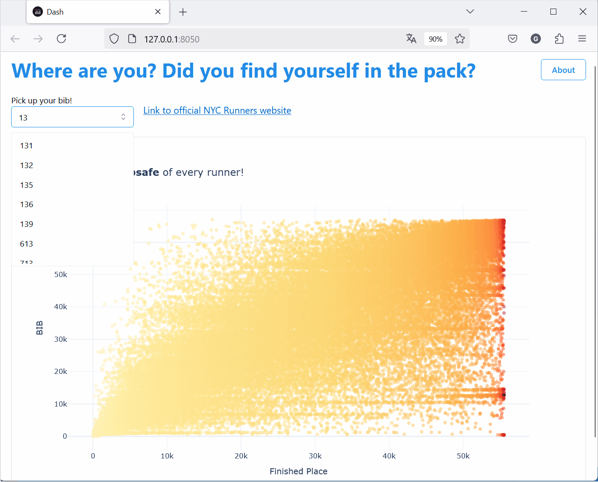

### Figure Friday Welcome 2025!! - W1
This week we will look at the results of the NYC Marathon that took place in November 2024. Data includes a runner’s name, age, gender, pace, final time, and much more.
Links here: https://community.plotly.com/t/figure-friday-2025-week-1/89701

In my first exploration of the data, I came across this curve, and I was hooked immediately! It is as beautiful as it is informative. From the operational standpoint, understanding race times and being able to estimate the number of participants to deal with allows for better planning and management supplies. This ensures that every runner receives something, whether it is a cup of water, an energy gel or anything else.

On the second part, the app maps the bib number, which every runner receives upon registration, to their position in the overall finishing table and has a link to the official website of NYC Road Runners.
Why the bib? Well, any amateur runner understands the training and commitment required to complete any race, let alone a 42km marathon. This is why the bib number is always kept as a lifelong memento—especially when we’re talking about the NYC Marathon!
It is built with dash-mantine-components v.0.15.1, thanks!! @AnnMarieW

