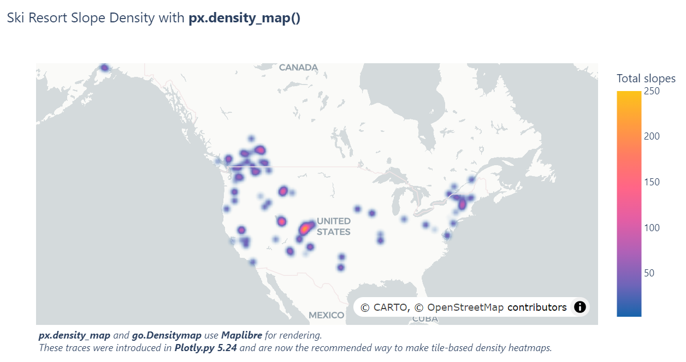
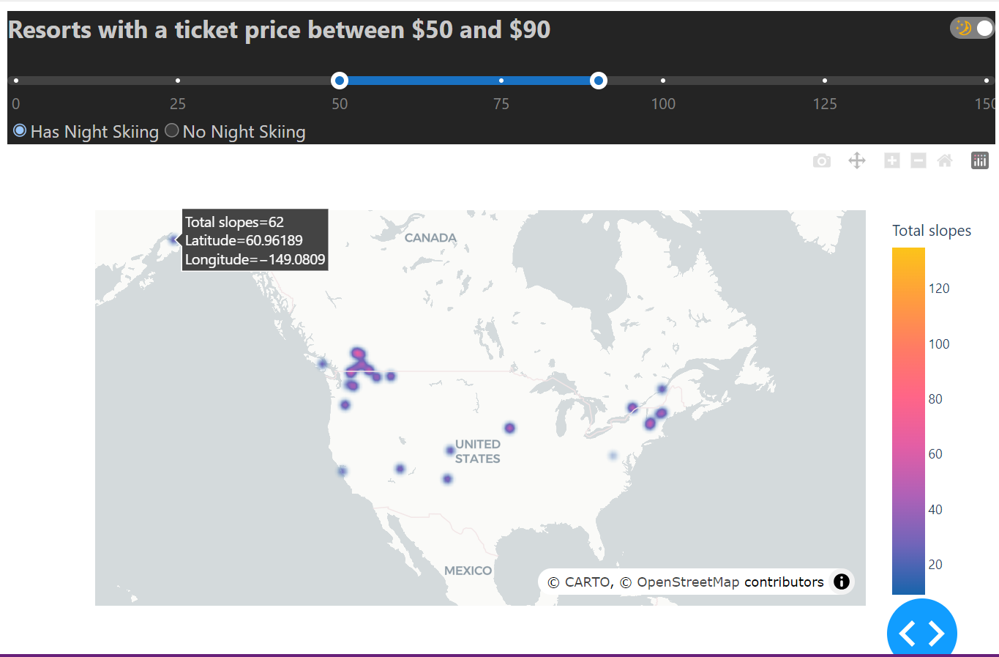
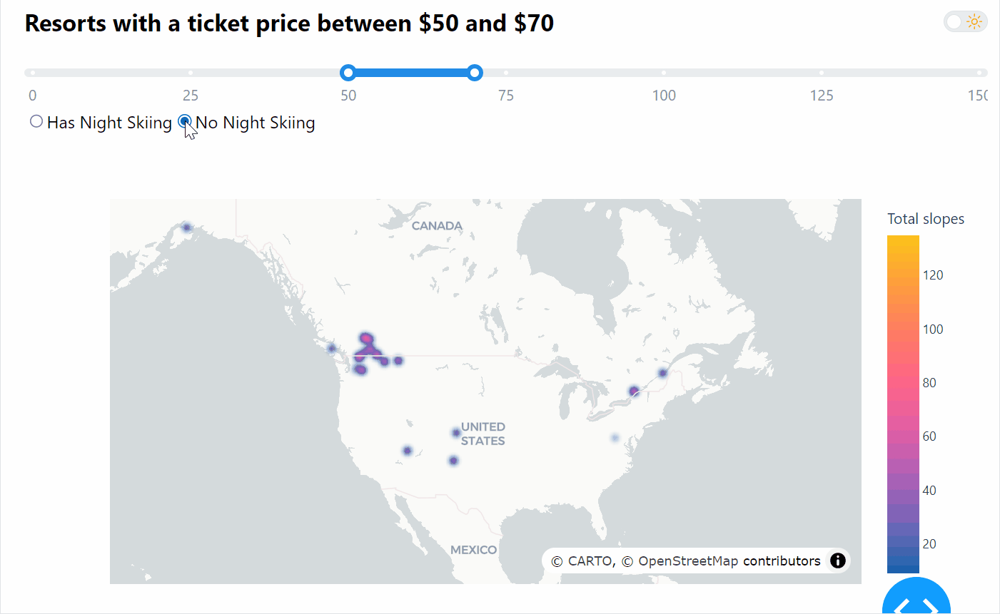

### Dashboard: Ski Resort Slope Density

Build an Application containing a density mapbox graph that displays color intensity based on `Total slopes`. This map should be centered roughly on the US/Canada.

* Add a slider to this application that filters the resorts mapped to those with a Price below the value selected in the slider.
* Add a radio button that toggles between resorts with night skiing and without night skiing. 
* Consider making your title dynamic based on the price input

