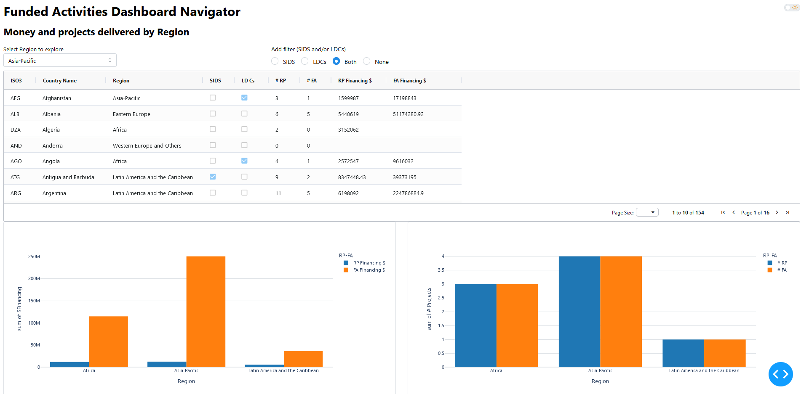
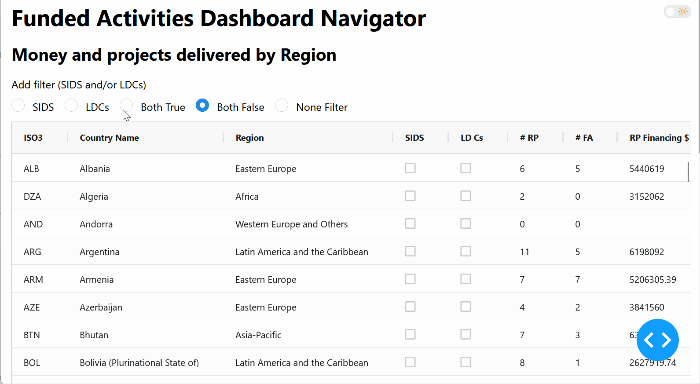
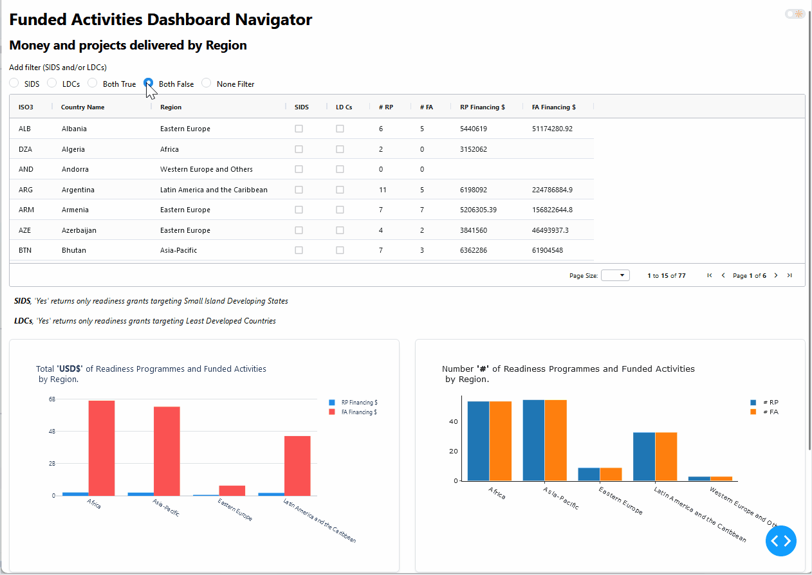

### Figure Friday 2025 - W3
[Plotly Community Forum - FigureFriday_2025_W3](https://community.plotly.com/t/figure-friday-2025-week-3/89961)

“Created by the United Nations Framework Convention on Climate Change, the Green Climate Fund aims to support a paradigm shift in the global response to climate change. It allocates its resources to low-emission and climate-resilient projects and programmes in developing countries.” [(UNEP)](https://www.unep.org/about-un-environment/funding-and-partnerships/green-climate-fund)

In week 3 of Figure Friday, we’ll explore the Climate Fund’s [data on these climate-resilient projects and programmes.](https://github.com/plotly/Figure-Friday/tree/main/2025/week-3)  
The above dataset represents the Countries tab, but feel free to analyze the other three tabs, such as the Fund Activities tab.

