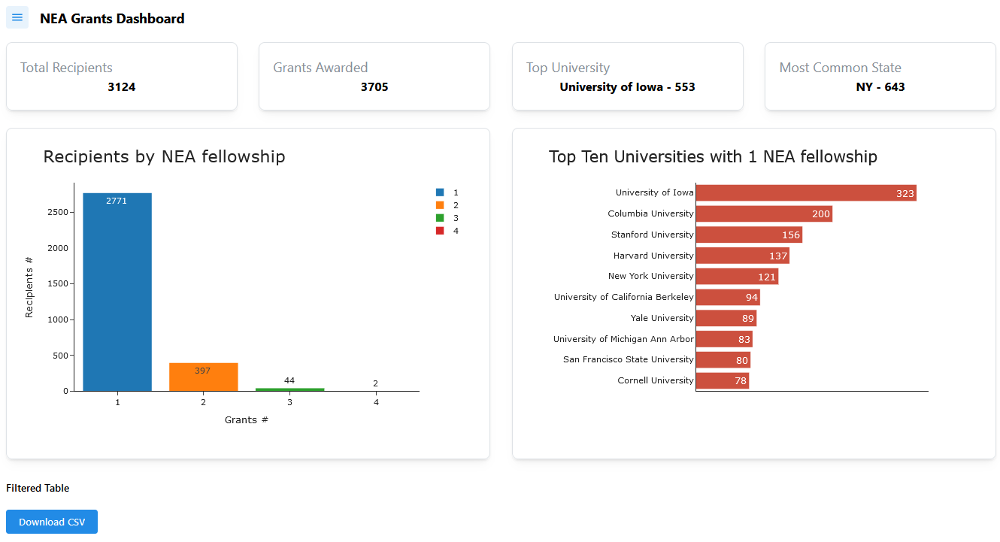
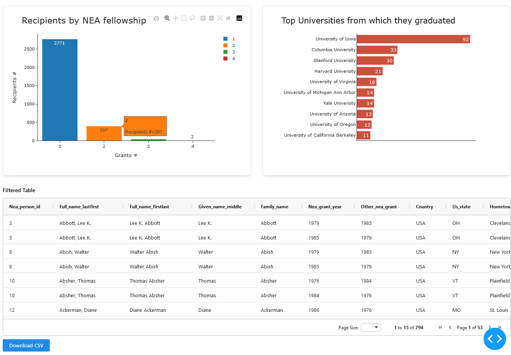
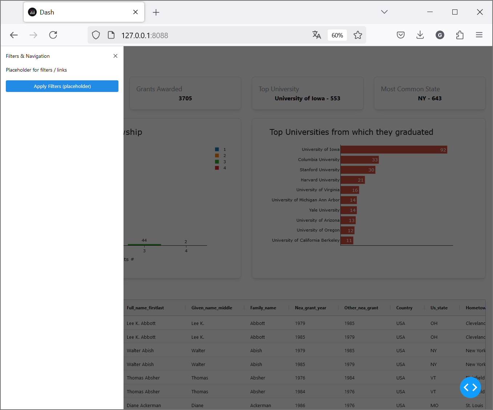
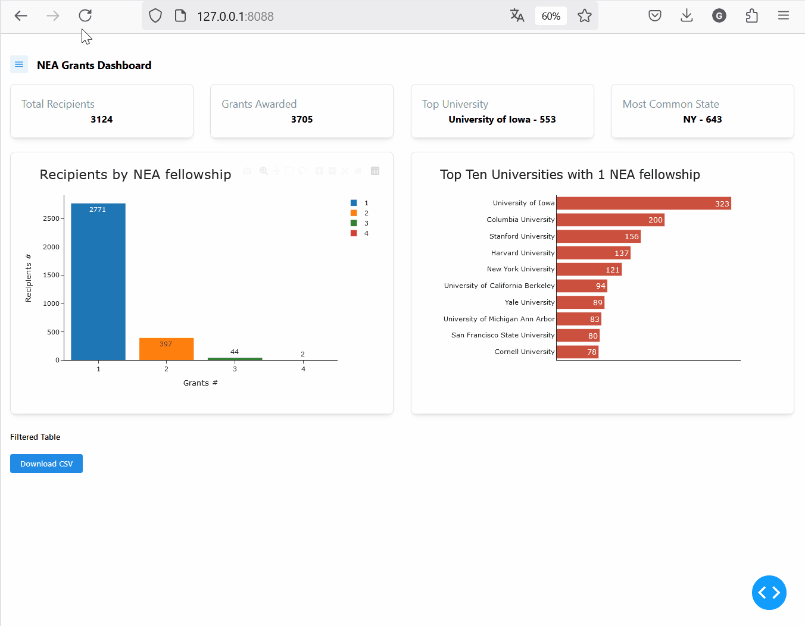

### Figure Friday 2025 - W4
[Plotly Community Forum - FigureFriday_2025_W4](https://community.plotly.com/t/figure-friday-2025-week-4/90162)

Figure Friday [week 4 dataset](https://github.com/plotly/Figure-Friday/tree/main/2025/week-4) contains a comprehensive list of the writers sponsored by the National Endowment for the Arts (NEA) fellowships from the organization’s founding in 1965 to 2024. It includes information about the writers’ demographics, education, and geography. [(Post45 Data Collective)](https://data.post45.org/posts/nea-creative-writing-fellowships/)

The question of **“how many writers have received more than one fellowship?”** led me to this dashboard.  
1. The bar chart required some data grouping, and then with **‘clickData’** over the bar chart, the table below updates to show only the selected writers, which are stored in a `dcc.Store component` for later download using the `dcc.Download` button.  
2. The bar chart also updates the **‘Top Universities’** chart.

